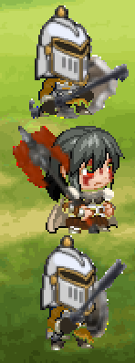

=============
Making a Team
=============

Now that you have seen the characters for hire, it's time to create your team! How you choose your characters --
and who you choose -- matters!

Team Formation
--------------

Every team consists of *three (3) characters*. No more, and no less! Teams will consist of *one (1) Leader* and
*two (2) Generic* characters. By finding a good combination of your hired team, victory for your country is assured!

When forming a team, you do so by modifying the return statement of your ``team_data()`` method. Recall that this
method returns a tuple containing 2 objects: a string literal and a nested tuple containing three enums in a specific
order.

.. code-block:: python

    def team_data(self) -> tuple[str, tuple[SelectGeneric, SelectLeader, SelectGeneric]]:
        return str, (SelectGeneric, SelectLeader, SelectGeneric)

The string literal will represent your team name. The nested tuple will contain specific enums determining which
characters you'd like to choose. Refer to :doc:`enums` for an expansive list of all enums.

It is important to order the enums in the order you'd like them to appear on the GameBoard. The first enum represents
the first Generic that will be on the top position; the second represents the Leader which will always start in the
middle; the third represents the second Generic that will be on the bottom.

    A team selection of a Generic Tank, Leader Ninlil, and another Generic Tank.

Selecting Leaders
-----------------

When selecting your Leader character, you can choose between 6 options. There are 2 leaders per ClassType:

Attacker ClassType:
    - Fultra
    - Ninlil

Healer ClassType:
    - Anahita
    - Berry

Tank ClassType:
    - Calmus
    - Irwin

The enums to select any one of these characters are the following:

.. code-block::

    SelectLeader.FULTRA
    SelectLeader.NINLIL
    SelectLeader.ANAHITA
    SelectLeader.BERRY
    SelectLeader.CALMUS
    SelectLeader.IRWIN

Selecting Generics
------------------

When selecting your Generic characters, you can choose between 3 options:

- Generic Attacker
- Generic Healer
- Generic Tank

The :doc:`enums` to select them are the following:

.. code-block::

    SelectGeneric.GEN_ATTACKER
    SelectGeneric.GEN_HEALER
    SelectGeneric.GEN_TANK

Valid Team Selections
---------------------

When selecting a team, duplicate characters are allowed, but to an extent. Every team is allowed to have a *maximum of
two (2)* characters with the same ClassType. The following will provide examples of valid team selections with
characters of duplicate CharacterTypes:

.. code-block:: python

    return (SelectGeneric.GEN_TANK, SelectLeader.CALMUS, SelectGeneric.GEN_HEALER)
    return (SelectGeneric.GEN_ATTACKER, SelectLeader.CALMUS, SelectGeneric.GEN_TANK)

    return (SelectGeneric.GEN_HEALER, SelectLeader.FULTRA, SelectGeneric.GEN_TANK)

    return (SelectGeneric.GEN_TANK, SelectLeader.ANAHITA, SelectGeneric.GEN_TANK)
    return (SelectGeneric.GEN_HEALER, SelectLeader.FULTRA, SelectGeneric.GEN_HEALER)
    return (SelectGeneric.GEN_ATTACKER, SelectLeader.CALMUS, SelectGeneric.GEN_ATTACKER)

The first and second examples show that your Leader's ClassType can be the same as *one (1)* Generic's ClassType.

The third example shows a team with every character having a unique ClassType (Healer, Attacker, Tank).

The fourth and fifth examples show how the two Generic characters can have the same ClassType, but the Leader
*must* have a different ClassType.

Malformed Character Selection
-----------------------------

In the case you to the dishonorable thing and try to cheat (🫵🤨) and submit a malformed team, you will *not*
receive all the characters you desire, so be mindful. Any character that is determined malformed will be replaced
with a different character: Generic Trash! Read more about Generic Trash in :doc:`characters`.

Here are examples of malformed character selections:

.. code-block:: python

    return (SelectLeader.CALMUS, SelectGeneric.GEN_TANK, SelectLeader.ANAHITA)

    return (SelectGeneric.GEN_HEALER, SelectGeneric.GEN_ATTACKER, SelectGeneric.GEN_TANK)

    return (SelectLeader.CALMUS, SelectLeader.CALMUS, SelectLeader.CALMUS)

    return (SelectLeader.CALMUS, SelectLeader.CALMUS, SelectGeneric.GEN_ATTACKER)
    return (SelectGeneric.GEN_ATTACKER, SelectLeader.CALMUS, SelectLeader.CALMUS)

    return (SelectGeneric.GEN_TANK, SelectLeader.CALMUS, SelectGeneric.GEN_TANK)

The first example is malformed since the ``SelectLeader`` enums are where the ``SelectGeneric`` enums should be, and
the ``SelectGeneric`` enum is where the ``SelectLeader`` enum should be. Every character would be replaced with Generic
Trash.

The second example is malformed since it's full of generics. The Generic Attacker would be replaced with Generic Trash.

The third example is malformed since it's full of Leader characters. The first and third SelectLeader enums would
be replaced with Generic Trash.

The fourth and fifth example are malformed since they have a single SelectLeader enum where a SelectGeneric enum
should be. That enum would be replaced with Generic Trash.

The last example has three (3) characters that have the same ClassType of Tank. The *Leader* would be replaced with
Generic Trash in this case.

Be mindful on how you order the tuple when selecting your team (unless you want to attempt to win at a deficit).
